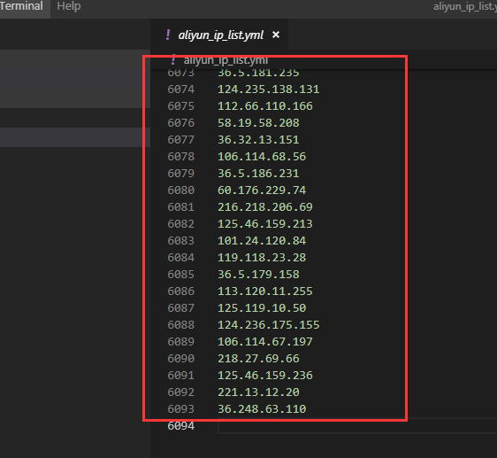
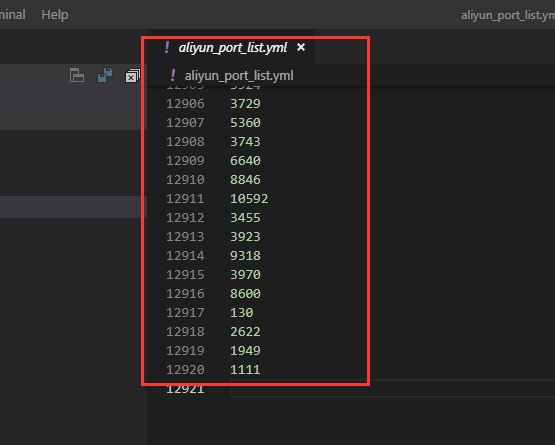

# 关注网络IP安全行为

欢迎大家把这些IP都添加为黑名单


## 统计（来自个人的真实的mongodb数据库统计）

截止2017-10-30 ——2019年7月29日

- 一共遭受6093 ip 攻击/访问



- 涉及来源的端口 10920个！端口 攻击/访问


## 添加黑名单方式 TODO

## 涉嫌Mongodb 攻击 TODO

## cc攻击 TODO

## APT攻击 TODO

## DDOS TODO

## 关于网络安全防范 TODO

### Mongodb  TODO
### Redis TODO
### Nginx  TODO

## 工具  TODO

## docker 查看mongodb日志

### datav.io 提供mongodb 受攻击日志

docker logs -f containerId | grep from   >> mongo.log 


将文件导入到https://datav.ai/tools/mognodb  (TODO 尚未开搞)即可列出手工具的数据

>【注】： 该工具只会文本的正则方式解析被的ip名单，不会记录用户的任何信息。

### 手动的方式，公布正则表达式

- nodejs

- python

测试版Python代码，todo，后续增加多维度统计。2019年7月29日10:54:56

```python
import re
ip_list=[] #ip list
port_list=[]

# 解析mongo.log 单行的数据，得到ip、port
def _findall(line):
    pattern_ip_port = re.compile(r'^.*from (.+?) \(\d .*$')  # ['1.202.68.84:40992 #6238']
    ip_port = pattern_ip_port.findall(line)
    str_ip_port = ''.join(ip_port)
    str_ip = re.sub(r':.*$', "", str_ip_port)  # 1.202.68.84
    str_port = re.sub(r'^.*:(.+?) #', '', str_ip_port)  # 40992
    ip_list.append(str_ip)
    port_list.append(str_port)

# 读写mongo日志，并写入
def parser_mongo_log():
    with open("file/aliyun-mongo.log", "r", errors='ignore') as f:
        for line in f:
            _findall(line)
    set_ip_list = list(set(ip_list))
    set_port_list = list(set(port_list))

    print("ip列表：", set_ip_list)
    print("端口列表：", set_port_list)

    # 不去重
    with open('file/aliyun_ip_list_all.yml', 'w') as f:
        for ip in ip_list:
            if len(ip) != 0:
                f.write(ip + '\n')
    with open('file/aliyun_port_list_all.yml', 'w') as f:
        for port in port_list:
            if len(port) != 0:
                f.write(port + '\n')
    # 写到一个文件里面去,去重
    with open('file/aliyun_ip_list.yml', 'w') as f:
        for ip in set_ip_list:
            f.write(ip + '\n')
    with open('file/aliyun_port_list.yml', 'w') as f:
        for port in set_port_list:
            f.write(port + '\n')

parser_mongo_logo()
```
- java

- rust

- shell

-
也可以通过